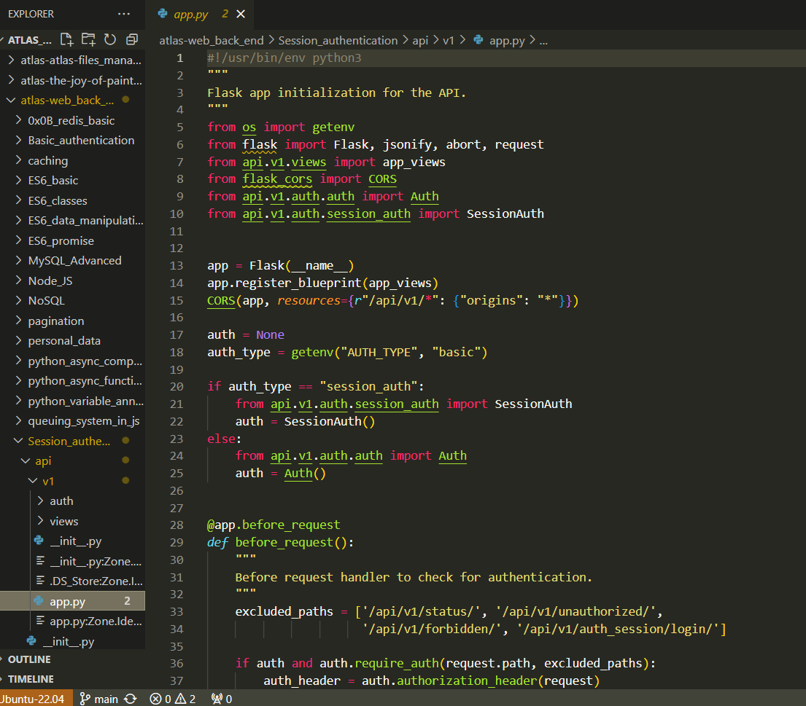

# Atlas Web Back-End

## About the Developer

Hi, I'm Parker Moore, the developer behind this project. I'm passionate about web development and enjoy working on applications' back-end and front-end aspects. You can connect with me on [LinkedIn](https://www.linkedin.com/in/parkermoore317/), or check out my [Portfolio Project repository](https://github.com/cpmoore0317/cpmoore0317.github.io).

## Project Description

Atlas Web Back-End is a repository that somewhat mimicks a comprehensive back-end service for a web application. It features various modules and functionalities, from authentication and data manipulation to caching and queuing systems. The project aims to provide a robust and scalable back-end solution, leveraging modern web technologies and best practices.

## Features

* **Redis Basic**: Basic integration and usage of Redis for caching and data storage.
* **Basic Authentication**: Implementation of basic authentication mechanisms.
* **ES6 Basics**: Introduction and usage of ES6 syntax and features.
* **ES6 Classes**: Advanced usage of ES6 classes in JavaScript.
* **ES6 Data Manipulation**: Techniques for manipulating data using ES6 features.
* **ES6 Promises**: Handling asynchronous operations using ES6 promises.
* **MySQL Advanced**: Advanced features and optimizations for MySQL databases.
* **NoSQL**: Introduction and usage of NoSQL databases.
* **Node.js**: Building scalable network applications using Node.js.
* **Session Authentication**: Implementation of session-based authentication.
* **Unit Tests and Integration Tests**: Comprehensive testing strategies for ensuring code quality.
* **Caching**: Implementing caching strategies to improve performance.
* **Pagination**: Techniques for implementing efficient pagination in applications.
* **Personal Data**: Handling and protecting personal data.
* **Python Async Comprehension**: Using async comprehensions in Python for efficient data processing.
* **Python Async Function**: Writing asynchronous functions in Python.
* **Python Variable Annotations**: Using type annotations in Python for better code readability and debugging.
* **Queuing System in JS**: Implementing a queuing system using JavaScript.
* **Unit Tests in JS**: Writing unit tests in JavaScript.
* **User Authentication Service**: Comprehensive user authentication service.

## Project Story

The development of the Atlas Web Back-End began with a focus on creating solid foundational aspects for web applications. Starting with basic authentication and data manipulation techniques, the project evolved to include advanced features such as session management, caching, and queuing systems. Throughout the development process, I encountered various challenges, including integrating different technologies, ensuring code quality through extensive testing, and optimizing performance.

### Implemented Features

* Basic and session-based authentication
* Data manipulation using ES6 features
* Asynchronous operations with ES6 promises and Python async functions
* Advanced database operations with MySQL and NoSQL
* Comprehensive unit and integration testing
* Caching and queuing systems

### Challenges Encountered

One of the most challenging aspects of this project was integrating various technologies and ensuring they work seamlessly together. Debugging asynchronous operations and optimizing database queries also posed significant challenges. However, these challenges provided valuable learning experiences and contributed to the overall robustness of the project.
